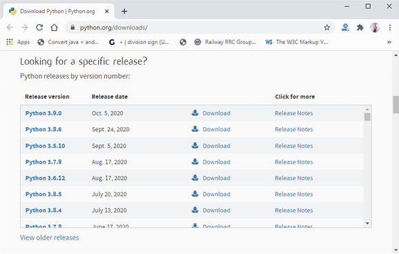
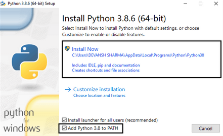
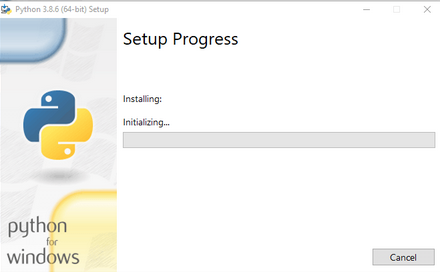
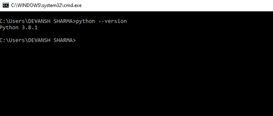

# SE-Assignment-6
 Assignment: Introduction to Python
Instructions:
Answer the following questions based on your understanding of Python programming. Provide detailed explanations and examples where appropriate.

 Questions:

1. Python Basics:
   - What is Python, and what are some of its key features that make it popular among developers? Provide examples of use cases where Python is particularly effective.
         Python is a dynamic, high-level, free open source, and interpreted programming language.
         Some of its key features include:
         - Readability and Simlpicity: Python's syntax is clean and easy to understand, which makes it accessible for beginners and allows for rapid development.
         - Versatility: Python can be used for a wide range of applications from web development and data analysis to machine learning and automation.
         - Extensive Standard Library: Python comes with a comprehensive standard library that supports many common programming tasks such as file I/O, system calls and data manipulation.
         - Large Ecosystem: There is a vast array of third-party libraries and frameworks available for Python, such as Django for web development, Pandas for data analysis, and TensorFlow for machine learning.
         - Community Support: Python has a large and active community, providing extensive documentation, tutorials, and forums for support.

         Use Cases
         1. Web development using frameworks like Django and Flask.
         2. Data Analysis and Visulaization using libraries like Pandas and Matplotlib.
         3. Machine Learning using libraries like Scikit-learn and TensorFlow.
         4. Automation and Scripting using libraries like Selenium and Requests for tasks such as file management , web scraping and more.
         5. Scientific Computing using libraries such as NumPy and SciPy.

   -----------------------------------------------------------------------------------------

2. Installing Python:
   - Describe the steps to install Python on your operating system (Windows, macOS, or Linux). Include how to verify the installation and set up a virtual environment.
         For you to use Python, you need to download it from the internet and install on your computer.

         Installation on Windows
         Visit the link https://www.python.org/downloads/ to download the latest release ofPython. In this process, we will install Python 3.8.6 on ourWindows operating system. When we click on the above link, it will bring us the following page.

         Step - 1: Select the Python's version to download.

         

         Step - 2: Click on the Install Now
         Double-click the executable file, which is downloaded; the following window will open.
         Select Customize installation and proceed.
         Click on the Add Path check box, it will set the Python path automatically.

         

         We can also click on the customize installation to choose desired location and features. Other important thing is install launcher for the all user must be checked.

         Step - 3 Installation in Process

         

         Now, try to run python on the command prompt. Type the command python -version in case of python3.

         

         How to Install a Virtual Environment using Venv
         Virtualenv is a tool to set up your Python environments. Since Python 3.3, a subset of it has been integrated into the standard library under the venv module. You can install venv to your host Python by running this command in your terminal:

               $ pip install virtualenv

         To use venv in your project, in your terminal, create a new project folder, cd to the project folder in your terminal, and run the following command:

               $ python [version] -m venv [virtual-environment-name]
         
         Now that you have created the virtual environment, you will need to activate it before you can use it in your project. On a mac, to activate your virtual environment, run the code below:

               $ source env/bin/activate

         This will activate your virtual environment. Immediately, you will notice that your terminal path includes env, signifying an activated virtual environment. 
         
         
   -----------------------------------------------------------------------------------------

Installing Python on windows

3. Python Syntax and Semantics:
   - Write a simple Python program that prints "Hello, World!" to the console. Explain the basic syntax elements used in the program.

         print("Hello, World!")

         Explanation:
         The print() function is used to output a string to the console. The string "Hello, 
         World!" is enclosed in double quotes. The print() function is followed by a comma, which indicates that the string is a parameter to the function. The print() function is called with the string as its argument. The print() function prints the string to the console. 

   ---------------------------------------------------------------------------------------

4. Data Types and Variables:
   - List and describe the basic data types in Python. Write a short script that demonstrates how to create and use variables of different data types.

      1. **Integers (`int`):**
         - Whole numbers, positive or negative, without a fractional component.
         - Example: `5`, `-3`, `100`
      2. **Floating-Point Numbers (`float`):**
         - Numbers that contain a decimal point.
         - Example: `3.14`, `-0.001`, `2.718`
      3. **Strings (`str`):**
         - Sequence of characters enclosed in single quotes (`'`), double quotes (`"`), or triple quotes (`'''` or `"""`).
         - Example: `"Hello, World!"`, `'Python'`
      4. **Booleans (`bool`):**
         - Represents truth values, can be either `True` or `False`.
         - Example: `True`, `False`
      5. **Lists (`list`):**
         - Ordered, mutable collection of items which can be of mixed data types.
         - Example: `[1, 2, 3]`, `["apple", "banana", "cherry"]`
      6. **Tuples (`tuple`):**
         - Ordered, immutable collection of items which can be of mixed data types.
         - Example: `(1, 2, 3)`, `("apple", "banana", "cherry")`
      7. **Dictionaries (`dict`):**
         - Unordered collection of key-value pairs, where keys are unique.
         - Example: `{"name": "Alice", "age": 30}`, `{"brand": "Ford", "model": "Mustang", "year": 1964}`
      8. **Sets (`set`):**
         - Unordered collection of unique items.
         - Example: `{1, 2, 3}`, `{"apple", "banana", "cherry"}`

      ### Script Demonstrating Different Data Types

            # Integer
            age = 25
            print(f"Age (int): {age}")

            # Floating-Point Number
            height = 5.9
            print(f"Height (float): {height}")

            # String
            name = "Alice"
            print(f"Name (str): {name}")

            # Boolean
            is_student = True
            print(f"Is Student (bool): {is_student}")

            # List
            fruits = ["apple", "banana", "cherry"]
            print(f"Fruits (list): {fruits}")

            # Tuple
            coordinates = (10.0, 20.0)
            print(f"Coordinates (tuple): {coordinates}")

            # Dictionary
            person = {"name": "Alice", "age": 25, "is_student": True}
            print(f"Person (dict): {person}")

            # Set
            unique_numbers = {1, 2, 3, 3, 2, 1}
            print(f"Unique Numbers (set): {unique_numbers}")

   
   ---------------------------------------------------------------------------------------
      

5. Control Structures:
   - Explain the use of conditional statements and loops in Python. Provide examples of an `if-else` statement and a `for` loop.

         Conditional statements are used to execute a block of code based on a certain condition. Loops are used to execute a block of code multiple times. An `if-else` statement is used to execute a block of code if a certain condition is true, and another block of code if the condition is false. A `for` loop is used to iterate over a sequence of items, such as a list or a string. 
         Example of an `if-else` statement: 
            
            age = 18
            if age >= 18:
               print("You are an adult.")
            else:
               print("You are a minor.")
         
         Example of an `for` loop statement:

            for i in range(5):fruits = ["apple", "banana", "cherry"]
            for fruit in fruits:
               print(fruit)

   ----------------------------------------------------------------------------------------

6. Functions in Python:
   - What are functions in Python, and why are they useful? Write a Python function that takes two arguments and returns their sum. Include an example of how to call this function. 

         Functions are blocks of reusable code that perform a specific task. They are useful because they help to organize code, reduce redundancy, and improve readability and maintainability. They allow you to encapsulate code logic into a single unit that can be called multiple times throughout your program.

               def add_numbers(a b):
               return a + b

               result = add_numbers(5, 7)
               print(f"The sum is: {result}")

   ----------------------------------------------------------------------------------------

7. Lists and Dictionaries:
   - Describe the differences between lists and dictionaries in Python. Write a script that creates a list of numbers and a dictionary with some key-value pairs, then demonstrates basic operations on both.

         A dictionary is a collection of key-value pairs, where each key is associated with a value. A list is a collection of items that can be accessed by their index. 
         Lists are indexed by their position, while dictionaries are indexed by their keys. 
         Lists are mutable, meaning their contents can be changed, while dictionaries are immutable, meaning their contents cannot be changed. 
         
         Example of a list: 
         numbers = [1, 2, 3, 4, 5]

         Example of a dictionary: 
         numbers_dict = {1: "one", 2: "two", 3: "}
         
         Basic operations on lists: 
         - Accessing elements: numbers[0] returns 1, numbers[1] returns 2 
         - Adding elements: numbers.append(6) adds 6 to the end of the list 
         - Removing elements: numbers.pop(0) removes the first element from the list.
         - Iterating through the list:
               for number in numbers: 
                  print(number)

         Basic operations on dictionaries:
         - Accessing values: numbers_dict[1] returns "one"
         - Adding key-value pairs: numbers_dict[4] = "four" adds the key-value to the dictionary
         - Removing a key-value pair: del numbers_dict[2]
         - Iterating through the dictionary:
               for key, value in numbers_dict.items():
                  print(f"{key}: {value}")
         
         
      ------------------------------------------------------------------------------------

8. Exception Handling:
   - What is exception handling in Python? Provide an example of how to use `try`, `except`, and `finally` blocks to handle errors in a Python script. 

         Exception handling is a mechanism for handling errors that occur during the execution of a program. It allows the program to continue running even if an error occurs, and to take appropriate action based on the type of error that occurred.

         Example of Exception Handling:
            def divide_numbers(a, b):
            try:
               # Try to perform the division
               result = a / b
            except ZeroDivisionError as e:
               # Handle the division by zero exception
               print(f"Error: Cannot divide by zero. ({e})")
               result = None
            except TypeError as e:
               # Handle the type error exception
               print(f"Error: Invalid input types. ({e})")
               result = None
            finally:
               # This block will always be executed
               print("Execution of try-except-finally block is complete.")
            return result

            # Example usage
            num1 = 10
            num2 = 0

            print(f"Trying to divide {num1} by {num2}:")
            result = divide_numbers(num1, num2)
            print(f"Result: {result}")

            num1 = 10
            num2 = 2

            print(f"\nTrying to divide {num1} by {num2}:")
            result = divide_numbers(num1, num2)
            print(f"Result: {result}")

            num1 = 10
            num2 = "two"

            print(f"\nTrying to divide {num1} by {num2}:")
            result = divide_numbers(num1, num2)
            print(f"Result: {result}")

   ---------------------------------------------------------------------------------------

9. Modules and Packages:
   - Explain the concepts of modules and packages in Python. How can you import and use a module in your script? Provide an example using the `math` module.

      Modules are files containing Python code that can be imported into other Python scripts. They allow you to reuse code and organize your code into logical units. Packages are collections of modules that are organized into a hierarchical structure. They allow you to organize your code into a more complex structure and make it easier to manage and maintain. 
      
      Example of Importing a Module:
            import math
            print(math.pi)

   ----------------------------------------------------------------------------------------

      
10. File I/O:
    - How do you read from and write to files in Python? Write a script that reads the content of a file and prints it to the console, and another script that writes a list of strings to a file.

         To read from a file, you can use the `open()` function to open the file in reading mode, and then use the `read()` method to read the contents of the file. 
         To write to a file, you can use the `open()` function to open the file in writing mode, and then use the `write()` method to write the contents of the file. 

         Example 
         # Read from a file
         with open("file.txt", "r") as file:
         content = file.read()
         print(content)

         # Write to a file
         with open("file.txt", "w") as file:
         file.write("Hello, World!") 

    
    --------------------------------------------------------------------------------------

# Submission Guidelines:
- Your answers should be well-structured, concise, and to the point.
- Provide code snippets or complete scripts where applicable.
- Cite any references or sources you use in your answers.
- Submit your completed assignment by [due date].